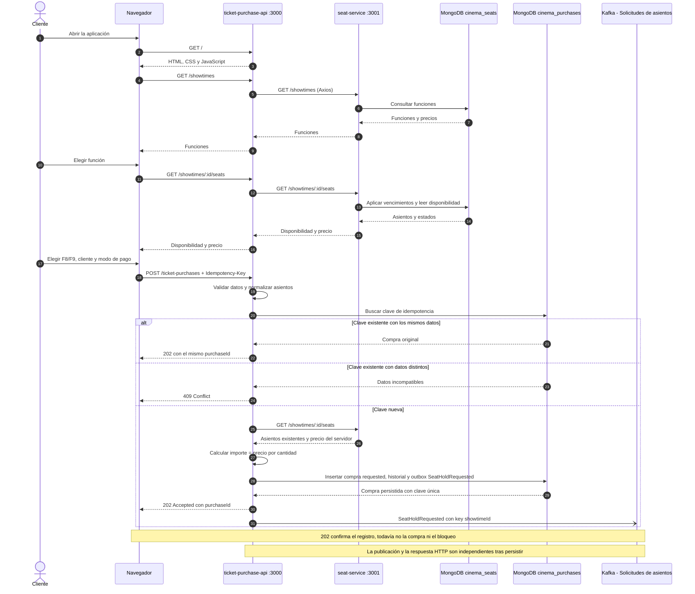
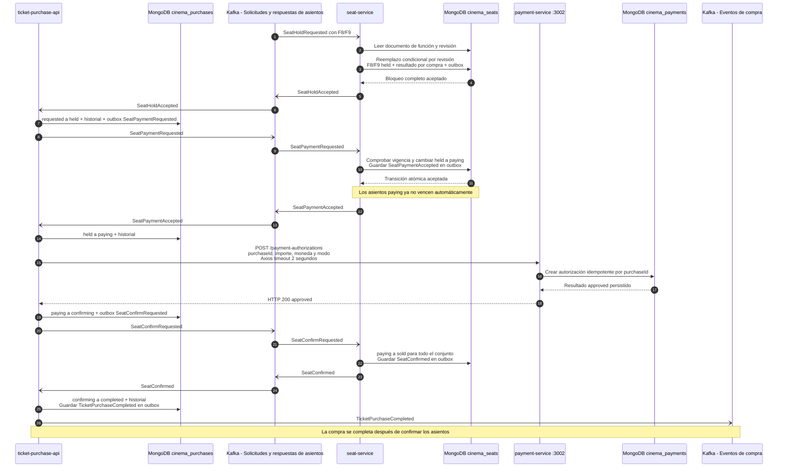
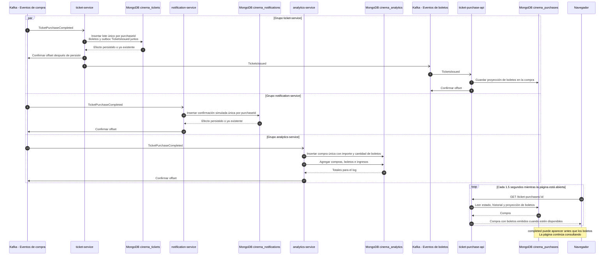
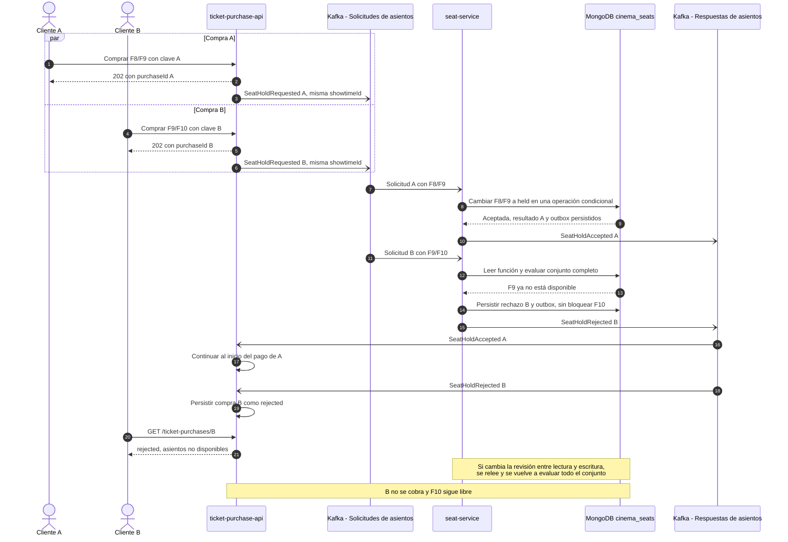
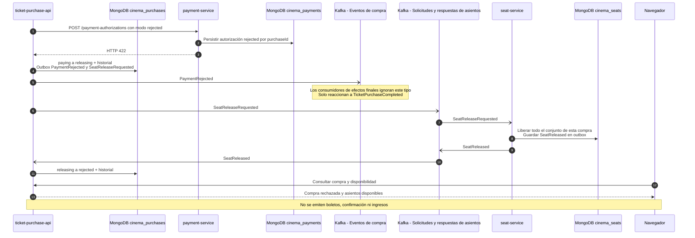
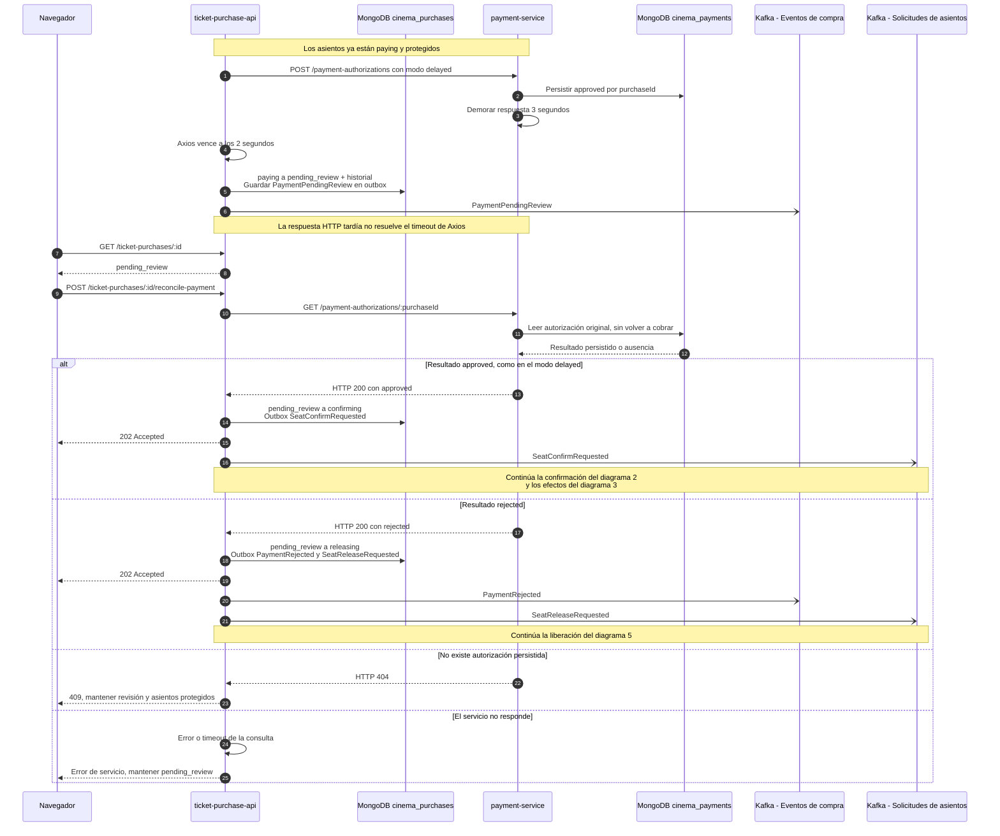
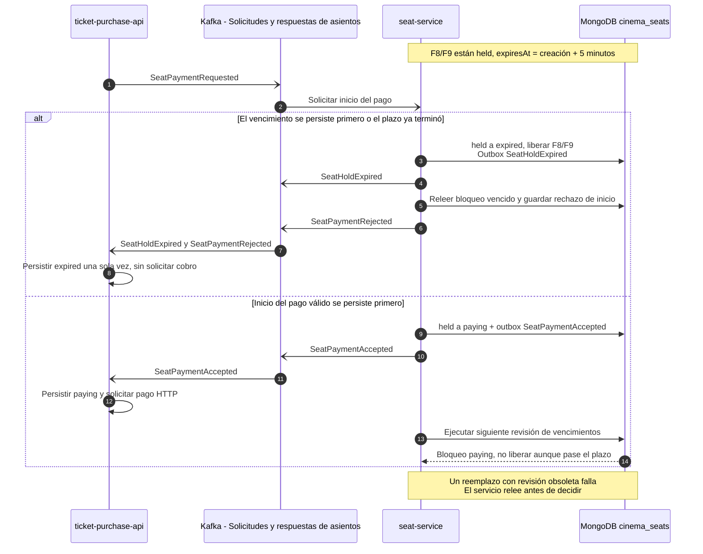
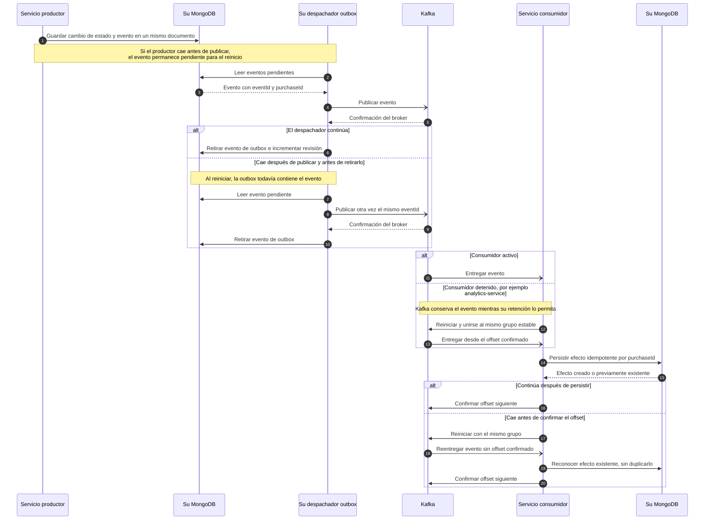

# Flujo completo de la aplicación de cine

Estos diagramas describen la implementación de [la aplicación](README.md). Se pueden visualizar en un lector Markdown con soporte para Mermaid. El flujo exitoso se divide en tres diagramas consecutivos; los siguientes muestran sus alternativas y la recuperación ante fallos.

## Cómo leerlos

Las flechas `->>` representan solicitudes HTTP u operaciones de persistencia; `-->>`, respuestas; y `-)`, envío o entrega de eventos asíncronos. Cada servicio accede únicamente a su propia base lógica de MongoDB, aunque todas residen en la misma instancia.

Las publicaciones Kafka dibujadas desde un servicio las realiza su despachador de eventos pendientes (**outbox**). Primero se persisten el estado y el evento en el mismo documento, y después se publica. El diagrama de recuperación detalla este mecanismo.

| Alias en los diagramas  | Tópico Kafka                | Key          |
| ----------------------- | --------------------------- | ------------ |
| Solicitudes de asientos | `cinema.seat-hold-requests` | `showtimeId` |
| Respuestas de asientos  | `cinema.seat-hold-events`   | `showtimeId` |
| Eventos de compra       | `cinema.purchase-events`    | `purchaseId` |
| Eventos de boletos      | `cinema.ticket-events`      | `purchaseId` |

Todos los eventos contienen `eventId`, `eventType`, `occurredAt` y `data`. El campo `data.purchaseId` permite seguir una compra entre servicios. Los tópicos tienen tres particiones y factor de replicación uno.

## 1. Selección y registro de la compra

Consultar disponibilidad no reserva asientos: la exclusividad se decide después, cuando `seat-service` procesa la solicitud de bloqueo.

Un cuerpo inválido o una clave ausente devuelve `400`. Una carrera entre dos solicitudes con la misma clave se resuelve mediante el índice único: se devuelve la compra existente o `409` si los datos difieren.

## 2. Bloqueo, pago aprobado y confirmación

Continúa la compra nueva del diagrama anterior. El bloqueo inicial dura cinco minutos. La API no solicita el pago hasta recibir `SeatPaymentAccepted`.

## 3. Boletos, notificación, analítica y seguimiento

Los tres consumidores de `TicketPurchaseCompleted` utilizan grupos distintos. No existe un orden global entre sus efectos: la notificación y la analítica no esperan a que se emitan los boletos.

La página también actualiza la disponibilidad cada 2.5 segundos mediante la API y `seat-service`.

## 4. Competencia por asientos: todos o ninguno

Dos compras comparten F9. Aquí A gana; si B se procesa primero, el resultado se invierte. Kafka agrupa las solicitudes de una función por key, pero la garantía de exclusividad reside en la actualización condicional de MongoDB.

## 5. Pago rechazado y liberación

Este escenario comienza después de que los asientos pasan a `paying`. La API no muestra el rechazo definitivo hasta recibir la confirmación de liberación.

## 6. Timeout y consulta manual del resultado

Un timeout significa que la API desconoce el resultado, no que el pago haya sido rechazado. En el modo `delayed`, el stub guarda una aprobación inmediatamente y demora tres segundos la respuesta.

La consulta nunca hace otro `POST /payment-authorizations`. Si la API reinicia y encuentra compras en `paying`, las pasa a `pending_review`: un proceso interrumpido tampoco permite asumir el resultado del cobro. Una conciliación sobre una compra que ya no está pendiente devuelve `409`.

## 7. Vencimiento contra inicio del pago

El vencimiento se aplica periódicamente y también al consultar asientos o procesar comandos. Solo libera bloqueos `held`; la revisión del documento resuelve la carrera con el inicio del pago.

## 8. Publicaciones pendientes, duplicados y consumidores detenidos

No hay una transacción distribuida entre MongoDB y Kafka. La outbox permite reintentar publicaciones, y la identidad por compra evita repetir efectos persistidos.

El resultado es entrega **al menos una vez** con efectos persistidos idempotentes, no una promesa de entrega exactamente una vez. El mismo principio permite recuperar `TicketsIssued` cuando el servicio de boletos reinicia con una publicación pendiente.

El Compose de Kafka no tiene volumen persistente. Estos diagramas de recuperación suponen que el broker conserva sus mensajes y offsets: recrearlo puede perderlos y no equivale a reiniciar un consumidor.
